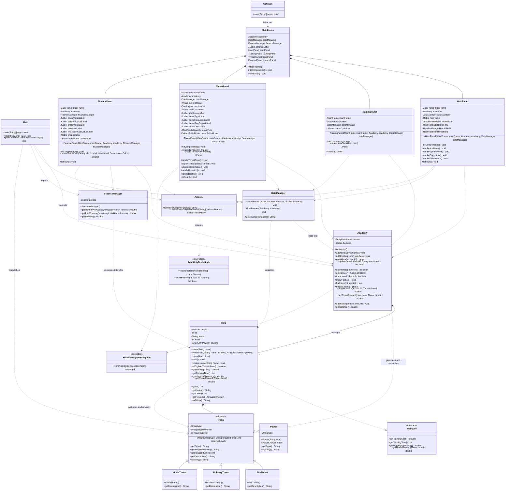

# Superhero Training Academy

A Java-based superhero management application with both a command-line
interface and a desktop GUI. Create and manage heroes, train them, respond to
city threats, and review academy finances.

<div style="font-size: 20px;">

## Features

- Create, rename, copy, list, and delete heroes
- Generate random fire, robbery, and villain threats
- Check hero eligibility based on level and powers
- Dispatch heroes to threats and collect rewards
- Train heroes and track their levels, training costs, and training times
- Calculate monthly allowances, tax-adjusted allowances, and academy-wide
  training costs
- Persist heroes and the academy treasury to a local `heroes.txt` file
- Use either the interactive console application or the Swing desktop interface

## Requirements

- Java Development Kit (JDK) 8 or newer
- A terminal for the console interface
- A graphical desktop environment for the Swing interface

No external libraries or package managers are required. The repository does
not currently include a Maven or Gradle build file.

## Getting Started

Clone the repository and move into the project directory:

```bash
git clone https://github.com/zzobaer09/SuperHeroTrainingAcademy.git
cd SuperHeroTrainingAcademy
```

Compile all source files into a local build directory:

```bash
mkdir -p out
javac -d out $(find src -name "*.java")
```

## Run the Application

### Console interface

```bash
java -cp out Main
```

The console menu supports hero management, training, threat dispatch, and
finance summaries. Select `8` to exit.

### Desktop GUI

```bash
java -cp out gui.GUIMain
```

The GUI provides four tabs:

1. **Hero Roster** — manage heroes and view their statistics
2. **Training Station** — train individual heroes
3. **Threat Dispatch** — scan for threats and dispatch eligible heroes
4. **Finance** — review treasury and per-hero financial data

## Data Persistence

The application reads and writes `heroes.txt` in the current working
directory. The file stores:

- The academy treasury balance
- Each hero's ID, name, level, and powers

Data is saved automatically after mutations such as adding, editing, deleting,
training, or successfully dispatching a hero. If no save file exists, the
application starts with an empty academy.

The file uses a simple comma-separated format and is intended for local
application use. Avoid commas in hero names or power values when editing the
file manually.

## Project Structure

```text
src/
├── Main.java                         # Console application entry point
├── academy/
│   ├── Academy.java                  # Hero roster and academy operations
│   ├── Hero.java                     # Hero state and trainable behavior
│   ├── Power.java                    # Hero power value object
│   └── Trainable.java                # Training and reward contract
├── data/
│   └── DataManager.java              # heroes.txt persistence
├── exceptions/
│   └── HeroNotEligibleException.java # Dispatch validation exception
├── finance/
│   └── FinanceManager.java           # Allowance and cost calculations
├── gui/
│   ├── GUIMain.java                  # Swing application entry point
│   ├── GUIUtils.java                 # Table utilities and helper methods
│   ├── HeroPanel.java                # Hero roster management tab
│   ├── MainFrame.java                # Main window and tab coordinator
│   ├── TrainingPanel.java            # Hero training tab
│   ├── ThreatPanel.java              # Threat dispatch tab
│   └── FinancePanel.java             # Finance dashboard tab
└── threat/
    ├── Threat.java                   # Base threat abstraction
    ├── FireThreat.java
    ├── RobberyThreat.java
    └── VillainThreat.java

bin/                                      # Pre-compiled .class files (should be git-ignored)
heroes.txt                                # Runtime data file (git-ignored)
```

## UML Class Diagram

The following diagram shows the complete application structure, including
domain entities, service classes, persistence, exception handling, console
entry points, and Swing UI dependencies.



## Domain Rules

- New heroes start at level 1 and receive three to five unique random powers.
- A hero can handle a threat only when their level meets the required level and
  they possess the required power.
- Training increases a hero's level by one.
- Threat rewards are added to the academy treasury.
- Finance calculations use a default tax rate of 10%.

### Available Powers

Heroes draw from the following pool during creation:

> Fire · Strength · Speed · Tech · Telepathy · Water · Ice · Lightning

### Threat Requirements

Each threat type has a fixed required power and minimum hero level:

| Threat   | Required Power | Required Level |
|----------|---------------|----------------|
| Fire     | Water         | 2              |
| Robbery  | Speed         | 3              |
| Villain  | Strength      | 5              |

### Threat Generation

When scanning for threats, there is a 25% chance of each outcome:

- No threat detected
- Fire threat
- Robbery threat
- Villain threat

### Financial Formulas

| Metric           | Formula                                          |
|------------------|--------------------------------------------------|
| Training Cost    | `100 + 25 × powerCount + 10 × level`            |
| Training Time    | `30 + 15 × powerCount + 5 × level` (minutes)    |
| Monthly Allowance| `500 + 100 × level + 25 × powerCount`           |
| Threat Reward    | `250 × threatRequiredLevel + 50 × heroLevel`    |

## Development Notes

The project currently has no automated test suite. After making changes,
compile the complete source tree before running either entry point:

```bash
rm -rf out
mkdir -p out
javac -d out $(find src -name "*.java")
```

Keep generated build output outside the tracked source tree when possible.
The repository includes a legacy `bin/` directory with pre-compiled `.class`
files. The compile instructions above use `out/` instead. Both directories
should be listed in `.gitignore` to avoid tracking build artifacts.

## Known Limitations

- Persistence is a lightweight, unescaped CSV-like format.
- The application has no database or multi-user storage.
- Training costs are displayed and calculated but are not currently deducted
  from the treasury.
- Console and GUI workflows share the domain model but have separate
  presentation logic.

## Contributing

1. Create a feature branch.
2. Make a focused change that preserves the existing console and GUI entry
   points.
3. Compile all Java sources using the command above.
4. Test the affected workflow manually.
5. Open a pull request describing the change and validation performed.

## License

No license is currently provided for this project. All rights are reserved
unless the repository owner grants permission otherwise.

</div>
