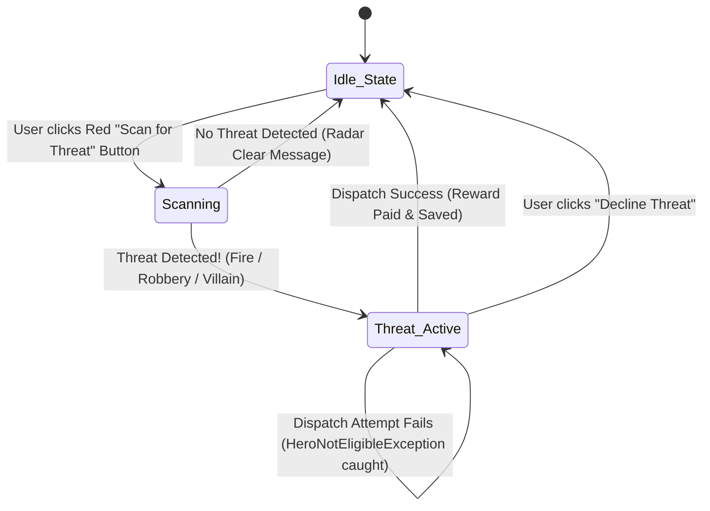

# Superhero Training Academy: Enterprise Architecture Blueprint (v3.0)

**Role**: Senior Software Architect  
**Architecture Pattern**: Layered Model-View-Controller (MVC) + Repository / Data Access Object (DAO) Pattern  
**GUI Framework**: Java Swing (`javax.swing.*`, `java.awt.*`)  

---

## 1. System Architecture Overview (Updated)

```mermaid
graph TB
    subgraph View ["Presentation Layer (Swing GUI)"]
        MAINFRAME[MainFrame]
        TAB_ROSTER[HeroPanel: Roster Tab]
        TAB_TRAIN[TrainingPanel: Training Tab]
        TAB_THREAT[ThreatPanel: Threat Dispatch Tab]
        TAB_FINANCE[FinancePanel: Finance Dashboard]
    end

    subgraph Controller ["Application & Controller Layer"]
        CTRL[Academy Controller / Action Listeners]
    end

    subgraph Identity ["Identity Layer"]
        ID_GEN[id.IdGenerator]
    end

    subgraph Model ["Domain & Business Layer"]
        ACADEMY[academy.Academy]
        HERO[academy.Hero]
        POWER[academy.Power]
        TRAIN_IF[<<interface>> academy.Trainable]
        THREAT[<<abstract>> threat.Threat]
        FIRE[threat.FireThreat]
        ROBBERY[threat.RobberyThreat]
        VILLAIN[threat.VillainThreat]
        FINANCE[finance.FinanceManager]
        FIN_DTO[finance.FinanceSummary]
        EXC[exceptions.HeroNotEligibleException]
    end

    subgraph Persistence ["Persistence Layer (Data Access)"]
        DM[data.DataManager]
    end

    subgraph Storage ["Dedicated Flat-File Storage Directory (data_files/)"]
        F_HEROES[(data_files/heroes.txt)]
        F_POWERS[(data_files/powers.txt)]
        F_FINANCE[(data_files/financeSummary.txt)]
    end

    MAINFRAME --> TAB_ROSTER & TAB_TRAIN & TAB_THREAT & TAB_FINANCE
    TAB_ROSTER & TAB_TRAIN & TAB_THREAT & TAB_FINANCE --> CTRL
    CTRL --> ACADEMY & FINANCE & DM
    
    HERO --> ID_GEN
    ACADEMY --> HERO
    HERO --> POWER
    HERO ..|> TRAIN_IF
    ACADEMY --> THREAT
    FIRE --|> THREAT
    ROBBERY --|> THREAT
    VILLAIN --|> THREAT
    ACADEMY -.->|Throws| EXC
    FINANCE --> FIN_DTO

    DM --> F_HEROES
    DM --> F_POWERS
    DM --> F_FINANCE
```

---

## 2. Complete Project File Directory Tree

All `.txt` persistence files are organized in a dedicated `data_files/` directory, completely isolating data storage from source code and documentation.

```
SuperheroTrainingAcademy/
├── .gitignore                              # Git version control ignore rules
├── README.md                               # High-level overview, architecture & setup guide
│
├── data_files/                             # [DEDICATED STORAGE DIRECTORY]
│   ├── heroes.txt                          # Flat-file database for all registered heroes
│   ├── powers.txt                          # Master catalog of powers & power descriptions
│   └── financeSummary.txt                  # Persistent treasury metrics & audit snapshot
│
├── docs/                                   # Architectural Documentation
│   ├── architecture_blueprint.md  			# Detailed MVC & Repository specifications
│   └── implementation_plan.md   			# implementation manual
│
└── src/                                    # Java Source Code
    ├── Main.java                           # Application entry point & Swing bootstrapper
    │
    ├── id/                                 # [IDENTITY PACKAGE]
    │   └── IdGenerator.java                # Generates & validates 8-char uppercase alphanumeric IDs
    │
    ├── academy/                            # [DOMAIN MODEL]
    │   ├── Trainable.java                  # Interface declaring formula contracts
    │   ├── Hero.java                       # Hero entity (8-char String ID, level, powers)
    │   ├── Power.java                      # Power value object (name + detail/description)
    │   └── Academy.java                    # Manager class for Hero roster & treasury operations
    │
    ├── threat/                             # [POLYMORPHIC THREAT DOMAIN]
    │   ├── Threat.java                     # Abstract base class for all threats
    │   ├── FireThreat.java                 # Subclass: ("Fire", "Water", Level 2)
    │   ├── RobberyThreat.java              # Subclass: ("Robbery", "Speed", Level 3)
    │   └── VillainThreat.java              # Subclass: ("Villain", "Strength", Level 5)
    │
    ├── data/                               # [PERSISTENCE LAYER]
    │   └── DataManager.java                # Centralized file I/O coordinator for data_files/
    │
    ├── finance/                            # [FINANCIAL ENGINE]
    │   ├── FinanceManager.java             # Calculation engine for allowances, taxes, & costs
    │   └── FinanceSummary.java             # Snapshot DTO for financeSummary.txt serialization
    │
    ├── exceptions/                         # [CUSTOM EXCEPTIONS]
    │   └── HeroNotEligibleException.java   # Checked exception for threat dispatch validation
    │
    └── gui/                                # [SWING PRESENTATION LAYER - 4 TABS]
        ├── MainFrame.java                  # Main Window (Header Banner, 4 Navigation Tabs)
        ├── HeroPanel.java                  # Tab 1: Hero Roster (JTable + Add/Update/Delete)
        ├── TrainingPanel.java              # Tab 2: Dedicated Hero Training Station (ID Input)
        ├── ThreatPanel.java                # Tab 3: Interactive Red Scan Button & Dispatch
        ├── FinancePanel.java               # Tab 4: Treasury Dashboard & Finance Summary File View
        └── UIUtils.java                    # Reusable UI styles, colors, and Red Button styling
```

---

## 3. Dedicated Data Storage Specification (`data_files/`)

### 1. `data_files/powers.txt` (Master Catalog of Superpowers)
- **Purpose**: Decouples powers from code. The system dynamically reads available powers from this file at runtime when creating new heroes.
- **Format**: `PowerName|PowerDetail` (or `PowerName,PowerDetail`)
- **Sample File Contents**:
  ```text
  Fire|Ability to generate and control intense thermal flames
  Water|Hydrokinetic manipulation of water streams and barriers
  Speed|Superhuman velocity, agile reflexes, and rapid reaction time
  Strength|Superhuman physical power and heavy impact resistance
  Tech|Mastery over cybernetics, gadgets, and digital hacking
  Telepathy|Mind reading, psionic shields, and mental projection
  Ice|Cryokinetic freezing and sub-zero temperature control
  Lightning|Electromagnetic storm generation and high-voltage bursts
  Flight|Defiance of gravity and high-altitude aerial maneuverability
  Invisibility|Bending light particles to achieve total visual stealth
  ```

### 2. `data_files/heroes.txt` (Hero Registry Flat File)
- **Purpose**: Persists the academy's registered heroes with their 8-character uppercase IDs and assigned powers.
- **Format**: `HeroID,HeroName,Level,Power1,Power2,Power3...`
- **Sample File Contents**:
  ```text
  A9K3X8Q2,Zobaer Man,2,Ice,Speed,Water,Lightning,Tech
  H7M2P9W4,Tahsan Man,6,Tech,Lightning,Strength,Ice,Water
  B4V1N8Z3,Cyber Knight,3,Tech,Lightning,Speed
  ```

### 3. `data_files/financeSummary.txt` (Financial Audit & State Snapshot)
- **Purpose**: Stores the persistent financial state of the academy. Updated whenever heroes are added, trained, deleted, or rewards are earned. The Finance Tab reads this file to render the dashboard.
- **Format**: Key-value pair configuration or structured record:
  ```text
  TREASURY_BALANCE=3100.00
  TOTAL_HEROES=3
  GROSS_MONTHLY_ALLOWANCE=3400.00
  TAX_RATE=0.10
  NET_MONTHLY_ALLOWANCE=3060.00
  TOTAL_TRAINING_COST=850.00
  LAST_UPDATED=2026-08-19 13:45:00
  ```

---

## 4. Package & Class Specifications (Feature-by-Feature)

### A. Identity Layer (`src/id/`)
- **`IdGenerator.java`**:
  - `public static String generateUniqueId(ArrayList<String> existingIds)`: Generates 8-character uppercase alphanumeric strings (`[A-Z0-9]{8}`).
  - `public static boolean isValidId(String id)`: Validates format against regex `^[A-Z0-9]{8}$`.

### B. Core Domain Model Layer (`src/academy/`)
- **`Power.java`**:
  - Fields: `private String name; private String detail;`
  - Getters: `getName()`, `getDetail()`. Overrides `toString()` to return `name`.
- **`Hero.java`**:
  - Fields: `private String id; private String name; private int level; private ArrayList<Power> powers;`
  - Dynamic power assignment: Selects 3–5 random unique `Power` objects from the list loaded from `powers.txt`.
  - Overloaded training methods: `train()` and `train(int)`.
- **`Academy.java`**:
  - Encapsulates `ArrayList<Hero>` and `double balance`.
  - Methods: `addHero(String name, ArrayList<Power> availablePowers)`, `trainHero(String id)`, `findHero(String id)`, `updateHero(String id, String newName)`, `deleteHero(String id)`, `dispatchHero(String id, Threat threat)`.

### C. Threat Hierarchy (`src/threat/`)
- **`Threat.java`** (Abstract): Defines `type`, `requiredPower`, `requiredLevel`, and abstract `getDescription()`.
- **`FireThreat.java`**: `"Fire"`, `"Water"`, Level 2.
- **`RobberyThreat.java`**: `"Robbery"`, `"Speed"`, Level 3.
- **`VillainThreat.java`**: `"Villain"`, `"Strength"`, Level 5.

### D. Data Persistence Layer (`src/data/`)
- **`DataManager.java`**:
  - Constant directory path: `private static final String DATA_DIR = "data_files";`
  - **Directory Auto-Creation**: Ensures `data_files/` directory exists (`new File(DATA_DIR).mkdirs()`).
  - **Power Catalog Methods**:
    - `public ArrayList<Power> loadPowers()`: Reads `data_files/powers.txt`. If file does not exist, seeds it with standard default powers.
  - **Hero Persistence Methods**:
    - `public void saveHeroes(ArrayList<Hero> heroes)`: Serializes heroes to `data_files/heroes.txt`.
    - `public ArrayList<Hero> loadHeroes()`: Deserializes hero records from `data_files/heroes.txt`.
  - **Finance Persistence Methods**:
    - `public void saveFinanceSummary(FinanceSummary summary)`: Writes snapshot to `data_files/financeSummary.txt`.
    - `public FinanceSummary loadFinanceSummary()`: Reads and parses `data_files/financeSummary.txt`.

### E. Financial Analytics Layer (`src/finance/`)
- **`FinanceSummary.java`** (DTO):
  - Encapsulates: `treasuryBalance`, `totalHeroes`, `grossAllowance`, `taxRate`, `netAllowance`, `totalTrainingCost`, `lastUpdated`.
- **`FinanceManager.java`**:
  - Computes gross allowances (overloaded for single `Hero` vs `ArrayList<Hero>`), net allowances after 10% tax, total academy training costs, and generates `FinanceSummary` snapshots.

---

## 5. GUI Presentation Layer Architecture (Java Swing)

```
+---------------------------------------------------------------------------------------------------+
| [🦸] SUPERHERO TRAINING ACADEMY                                 Treasury Balance: $3,100.00  [🔄] |
+---------------------------------------------------------------------------------------------------+
|  [ 👥 1. Hero Roster ] | [ ⚡ 2. Training Station ] | [ 🚨 3. Threat Dispatch ] | [ 📊 4. Finance ]|
+---------------------------------------------------------------------------------------------------+
```

### Tab 1: Hero Roster (`HeroPanel`)
- **Table Columns**: `[ ID (8-Char) | Name | Level | Powers | Training Cost | Monthly Allowance ]`
- **Actions**:
  - `[ ➕ Add Hero ]`: Prompts for name, selects 3–5 random powers from `powers.txt` catalog, assigns 8-char ID, saves to `heroes.txt`, recalculates and saves `financeSummary.txt`.
  - `[ ✏️ Update Name ]`: Prompts for new name for selected Hero ID.
  - `[ 🗑️ Delete Hero ]`: Deletes hero, auto-saves `heroes.txt` and `financeSummary.txt`.

---

### Tab 2: Dedicated Hero Training Station (`TrainingPanel`)
- **Interactive UI**:
  - Input box: `Enter 8-Digit Hero ID: [ A9K3X8Q2 ]` $\rightarrow$ `[ 🔍 Check Hero ]`.
  - Details Card: Hero Name, Current Level $\rightarrow$ Next Level, Active Powers list, Required Training Cost ($), Training Time (mins).
  - Main Action: `[ ⚡ TRAIN HERO (+1 LEVEL) ]`.
  - On Click: Increments level, displays confirmation popup, updates table, saves `heroes.txt`, updates `financeSummary.txt`.

---

### Tab 3: Threat Scanner & Dispatch Radar (`ThreatPanel`)
Operates as a robust state machine:



1. **Idle State**: Displays prominent **Red "Scan for Threat"** button.
2. **Scan Result $\rightarrow$ None**: Shows *"Radar Clear! City is safe."* and keeps the **Red Scan Button**.
3. **Scan Result $\rightarrow$ Active Threat**:
   - Renders Threat Card: Threat Type, Required Level, Required Power, Story Description.
   - Reveals Hero Dispatch Station: `Enter Hero ID: [ H7M2P9W4 ]` + `[ 🚀 DISPATCH HERO ]` + `[ ❌ Decline ]`.
4. **Dispatch Execution**:
   - Catches `HeroNotEligibleException` and shows warning dialog.
   - On success: awards reward to treasury, updates live balance, auto-saves `financeSummary.txt`, and resets back to the **Red Scan Button**.

---

### Tab 4: Financial Summary & Treasury Dashboard (`FinancePanel`)
- **File-Driven UI**: Fetches data directly from `data_files/financeSummary.txt`.
- **Top Summary Cards**:
  - 💰 **Treasury Balance**: `$3,100.00`
  - 👥 **Total Heroes**: `3`
  - 📈 **Gross Monthly Allowance**: `$3,400.00`
  - 🏷️ **Net Allowance (after 10% Tax)**: `$3,060.00`
  - ⚡ **Total Training Cost**: `$850.00`
  - 🕒 **Last Saved**: `2026-08-19 13:45:00`
- **Actions**: `[ 🔄 Reload from financeSummary.txt ]` button.
- **Detailed Sub-table**: Per-hero training costs, times, and allowances.

---

## 6. Implementation Roadmap & Development Phases

```
[Phase 1: Storage & Identity Layer]
   ├── Create data_files/ directory
   ├── Seed data_files/powers.txt
   └── Create src/id/IdGenerator.java
          │
          ▼
[Phase 2: Domain & Persistence Integration]
   ├── Update Power.java (name + detail)
   ├── Update Hero.java (String ID, dynamic powers from powers.txt)
   ├── Create FinanceSummary.java DTO
   └── Build DataManager.java for data_files/ (heroes.txt, powers.txt, financeSummary.txt)
          │
          ▼
[Phase 3: Swing UI Foundation & Theme]
   ├── Create UIUtils.java (custom red scan button, fonts, cards)
   └── Build MainFrame.java with 4 tabs & Header Balance Badge
          │
          ▼
[Phase 4: Tab 1 (HeroPanel) & Tab 2 (TrainingPanel)]
   ├── Tab 1: Hero Roster JTable + Add/Update/Delete handlers
   └── Tab 2: Training Station (ID lookup + level training + auto-save)
          │
          ▼
[Phase 5: Tab 3 (ThreatPanel) & Tab 4 (FinancePanel)]
   ├── Tab 3: Red Scan Button State Machine + Exception Catching + Reset
   └── Tab 4: Dashboard reading data_files/financeSummary.txt
          │
          ▼
[Phase 6: End-to-End Persistence & Validation]
   └── Verify file integrity in data_files/ across all user workflows
```
